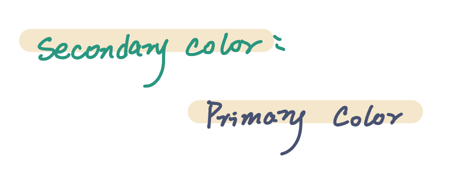
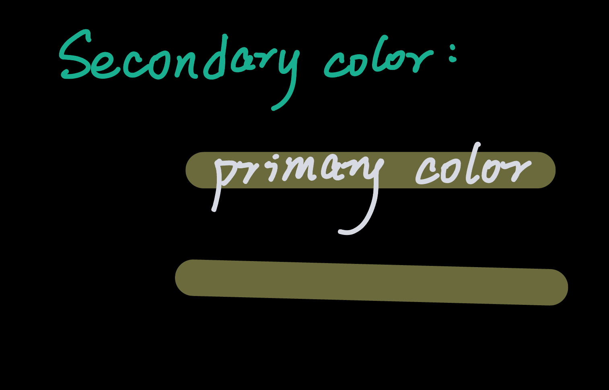

# Assignment 5

## Project Overview
**Project Name:** AuraLab

**Platform:** Web

**GitHub:** [Link](https://github.com/hanxi-guo/CIS412_AuraLab)

**Summary:**  
Our application is a vibe-crafting studio designed to help influencers organize, edit, and analyze multi-post campaigns, which integrated with AI.

---

## Implementation Prototypes

### 1. Hello World App
**Description:**  
We will use **HTML** and **React** with **Tailwind CSS** to build a simple web application.  
When the app runs, the homepage will display the text **“Hello World”**, demonstrating that our environment is correctly set up and that we can render a functional frontend on the target device (web browser on computer).

---

### 2. Hello Styles
**Description:**  
Following our style guide, we will display all fonts, colors, and icons used in our prototype and 'Hello World' page. The style showed here is flexible to change during our accomplishment.  
Styles include:  
- White System: 
  - color palette: 
    - Primary: #475272
    - Secondary: #29967F
    - Accent: #E6C584

- Black System:
  - color palette: 
    - Primary: #D8DAE3
    - Secondary: #19B092
    - Accent:  #fdf68c

- typeface: Inter at light, medium, and bold fonts
- icon set: The Material 3 Design Kit and the Simple Design System set
 

---

# 3. Social Media Campaign Agent Manager

## Target User:
- Professional Influencers
- Social media marketing teams
## UI elements
### 1. Main Viewport:
- Node-based
	- Agent is root node, posts are child nodes of agent
		- Agent generates social media post
		- User input: 
			1. Description of brand voice (e.g. cheerful, peppy, etc.)
			2. Target audience for campaign
			3. Attach specification documents
			4. Platforms for posting (e.g. Instagram, X, etc.)
		- User can edit posts post-generation
	- Click to expand node in overlay
- Paper texture background
### 2. Sidebar:
- To manage different projects
- Search function
## Backend
- Calls OpenAI API
- Nodes stored in SQL database
